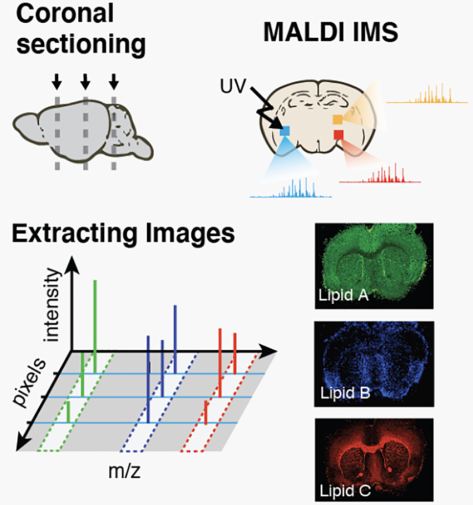
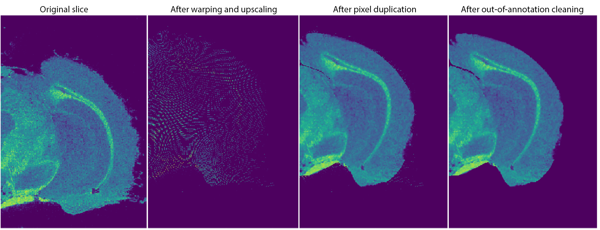

# Lipid Brain Atlas Explorer documentation 

<p align="center"></p>

## Overview

The Lipid Brain Atlas Explorer is a Python Dash web-application developped as part of the **Lipid Brain Atlas project**, led by the [Lipid Cell Biology lab (EPFL)](https://www.epfl.ch/labs/dangelo-lab/) and the [Neurodevelopmental Systems Biology (EPFL)](https://www.epfl.ch/labs/nsbl/). It is thought as a graphical user interface to assist the inspection and the analysis of a large mass-spectrometry dataset of lipids distribution at micrometric resolution across the entire mouse brain.

All of the brain slices aquired have prealably been registered to the [Allen Mouse Brain Common Coordinate Framework v3.0](https://www.sciencedirect.com/science/article/pii/S0092867420304025) (CCFv3), allowing for a hierarchically structured annotation of our data. This registration can be used to display lipid signal between two m/z boundaries in a given slice (*lipid selection* page, in the app) and perform analyses comparing neuroanatomical regions, e.g. averaging and comparing lipid abundance in each region and make an enrichment analysis (*region analysis* page, in the app). It is also used to combine the 2D slice acquisitions into a browsable 3d model of lipid expression (*three dimensional analysis* page, in the app). Finally, scRNAseq data can also be compared to lipidomics data, in the *spatial transcriptomics* page.

We hope that this application will be of great help to query the Lipid Brain Atlas to guide your hypotheses and experiments, and more generally to achieve a better understanding of the cellular mechanisms involving lipids that are fundamental for nervous system development and function.

## Data

<p align="center"></p>

The multidimensional atlas of the mouse brain lipidome that you can explore through LBAE has been entirely acquired from MALDI Mass Spectrometry Imaging (MALDI-MSI) experiments. We have collected about 6 million mass spectra, corresponding to 18’000 lipid images of 64 serial sections of two individual adult mouse brains (8 weeks old males BL6). Each pixel captures a region of $5μm$, with a spatial resolution of $25μm$ along a given slice and about $200μm$ across slices. The spectral resolution is of the order of $10^{-5} m/z$.

## Alignment to the Allen Brain Atlas

The 64 slices were aligned to the [adult mouse brain reference](http://atlas.brain-map.org/atlas?atlas=602630314#atlas=602630314&plate=576989940&structure=549&x=5280.271251166045&y=3744.257593866604&zoom=-3&resolution=11.93&z=3) acquired by the Allen Institute using [ABBA](https://biop.github.io/ijp-imagetoatlas/), a FIJI plugin developed at EPFL for the registration of thin mouse brain slices.

Each slice image was built from three different channels, each corresponding to a different set of lipids highlighting different types of structures in the brain. Image were then manually warped and aligned using landmark points. A higher resolution version of the warped slices was exported, along with the corresponding deformation field and the original and warped coordinates in the CCFv3 reference.

<p align="center"></p>

This procedure allows to track the displacement of every single slice pixel, each of which is linked to a MALDI-MSI spectrum. Due to the warping and upscaling, some pixels are duplicated to fill the empty regions in the final slice image.

## How to use the app

A documentation explaining the use of the app is contained inside of the app, in front page. 


## Use and deployment

The app is compatible with Python 3.8 and is guaranteed to work until version 3.9.5. 

Required packages can be installed with: 

```pip install -r requirements.txt```

Warning: The Dash version version MUST BE <=2.5.1, otherwise, bug may be present with long_callbacks.

The app can be run locally using the command:

```python main.py```

The first time the app is executed, if the shelve database (in the folder data/app_data/) doesn't exist, it will have to be built from scratch. This means that all the app precomputations will take place, which can take ~1 day of computation.

The app can be deployed on a server with Gunicorn (here with 4 threads and only 1 worker to avoid using too much RAM):

```gunicorn main:server -b:8077 --worker-class gevent --threads 4 --workers=1```

In both cases, it will be accesible with a browser at http://localhost:8077.


## Technical documentation

The technical documentation of the app is available at TODO.


## Citing

If this app has been useful to your research work, it would be very much appreciated that you cite the papers companion to this app (still undisclosed, this will be updated).

## About

The app (frontend and backend) was developed by Colas Droin under the supervision of Gioele La Manno and Giovanni d'Angelo, as part of the Lipid Brain Atlas project. Laura Capolupo was involved in data collection and acquisition, Hannah Schede was involded in the development of MAIA. 

